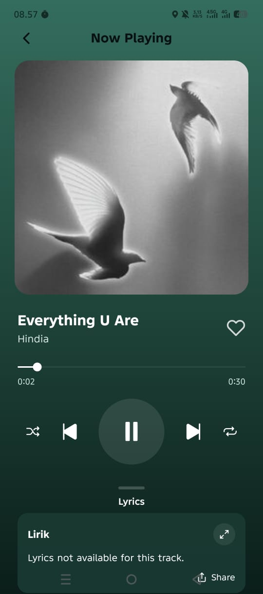
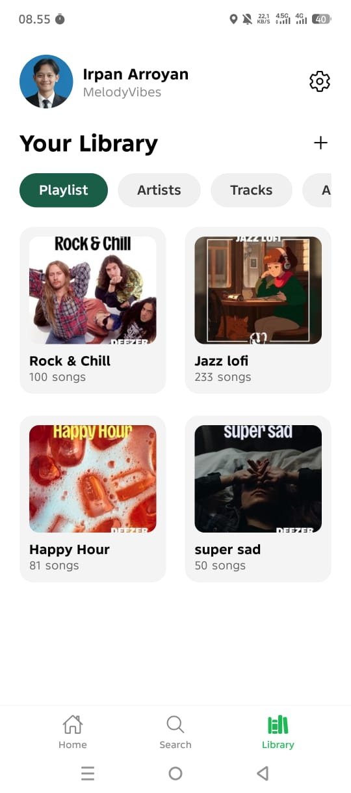
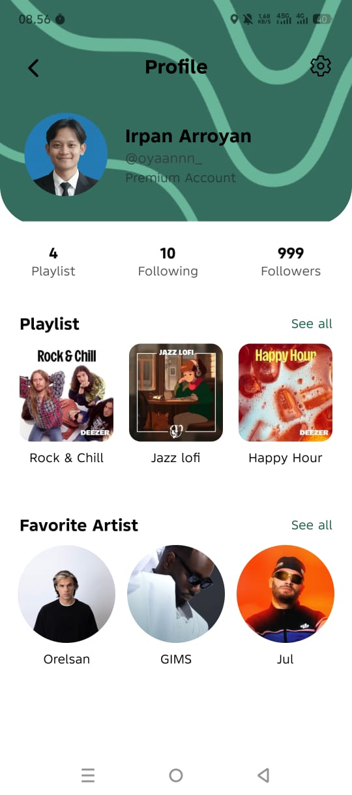

# Pemrograman Perangkat Mobile - MelodyVibes App

> This is a mobile device programming project that uses [Expo](https://expo.dev)

- Name  : MUHAMMAD IRPAN ARROYAN
- NIM   : 20230040118
- Lecturer : NUGRAHA, M.Kom

## How to Run

1. Start the app

   ```bash
   npm start
   ```

2. Scan the barcode with [Expo Go](https://expo.dev/go)

## UI Design Link

- https://www.figma.com/design/CrLxNGuTAkuiaMpe3r6Pyn/Music-UI-Design?node-id=0-1&t=uYRFsOYAaoYBgtjY-1

## Demo recording of the application

[](https://youtu.be/RY77RIPYli4)

## Screenshoot







