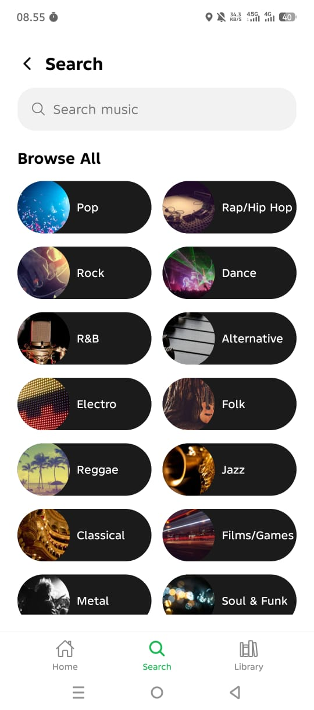
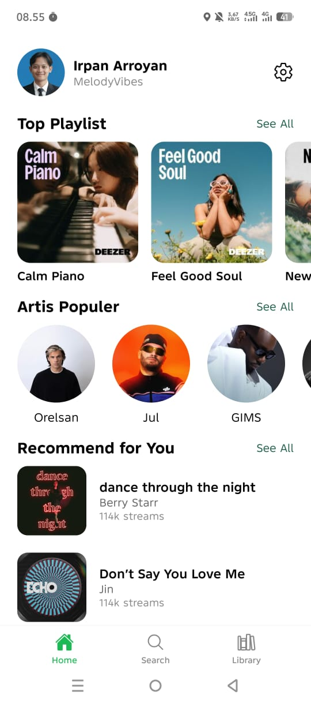
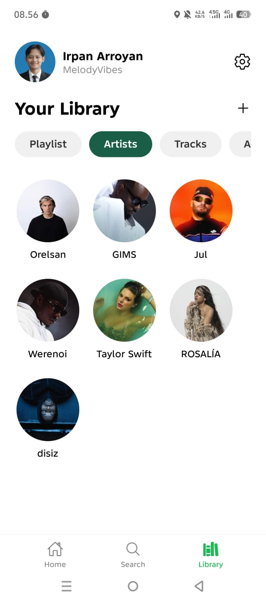
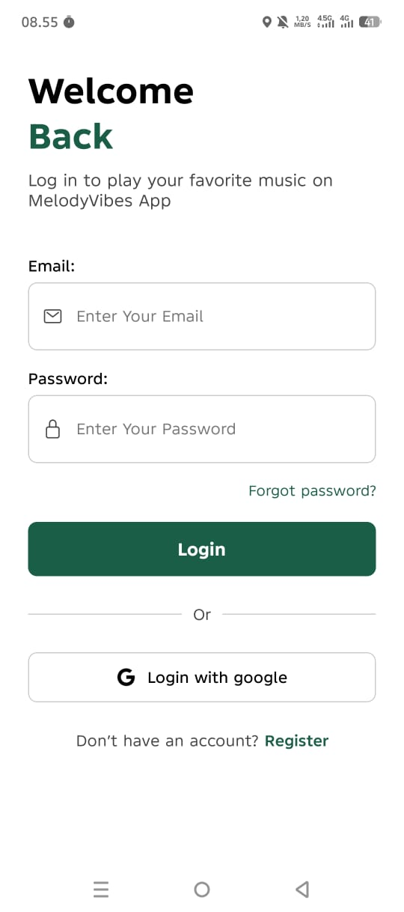

# Pemrograman Perangkat Mobile - MelodyVibes App

> This is a mobile device programming project that uses [Expo](https://expo.dev)

- Name  : MUHAMMAD IRPAN ARROYAN
- NIM   : 20230040118
- Lecturer : NUGRAHA, M.Kom

## How to Run

1. Start the app

   ```bash
   npm start
   ```

2. Scan the barcode with [Expo Go](https://expo.dev/go)

<!-- ## Demo recording of the application

[](https://youtube.com/shorts/85xhMCB6CNU?feature=share)

<!-- ## Screenshoot



 --> -->


